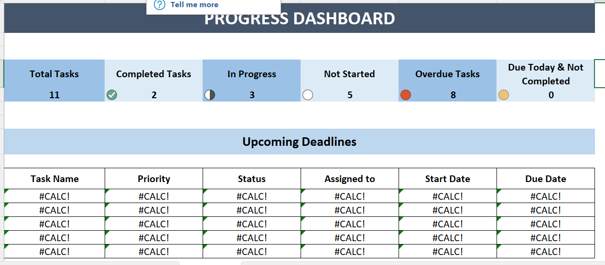

# 📋 Automated Task Tracker & Progress Dashboard

An Excel-based task tracking system powered by VBA UserForm and a dynamic dashboard.

---

## ✨ Features
- Add, update, and remove tasks using a custom-built UserForm
- Dashboard with KPIs: total tasks, completed, pending, overdue
- Showcase upcoming deadlines

---

## 🧩 VBA Functionality
- UserForm with dropdowns, date pickers, and status inputs
- Code to update "TaskList" sheet with each form entry
- Automatic dashboard updates upon task changes

---

## 🌟 Benefits
- Replaces manual task tracking
- Visual status monitoring
- Great for daily planning and follow-ups

---

## 🖼️ Screenshots

| Task Entry | Dashboard |
|------------|-----------|
|  |  | 

---

## 👩‍💻 Author
Chamudi | Excel VBA Enthusiast
